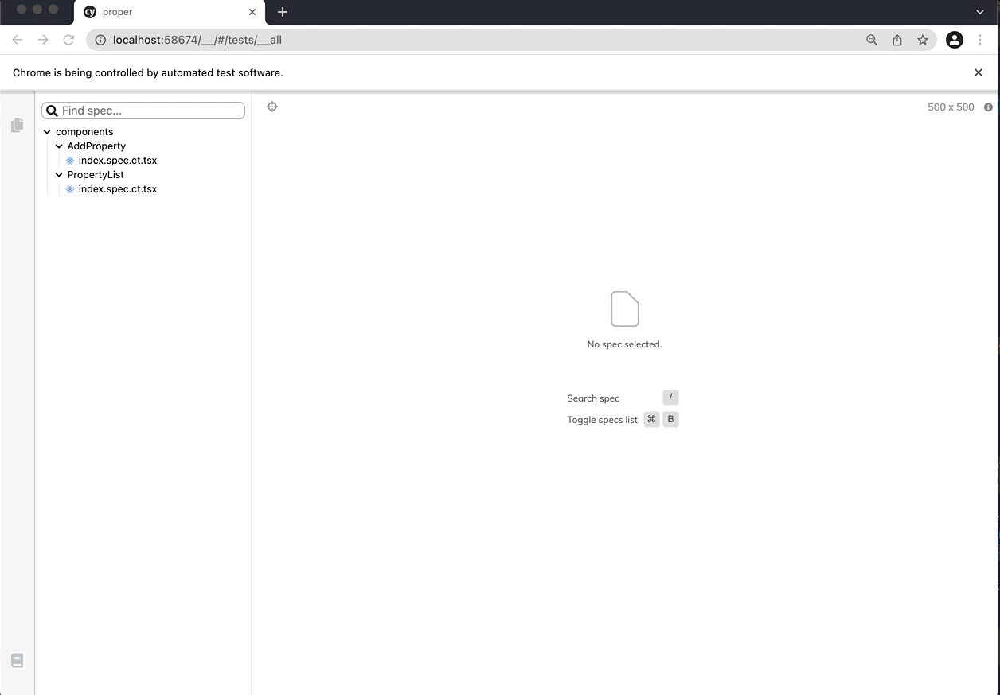

# Property Portfolio

Very simple proof of concept NextJS app with cypress.

## Setup

1. clone the repo
2. install dependencies (`yarn`)
3. create `.env.local` file with `TOKEN=<your DAWA token>`

## Developing

```sh
yarn dev
```

## Testing

The project has been TDD using cypress component testing

```sh
yarn test
```

## Decisions/trade-offs

Decided to use start off from a cypress component testing nextJS boilerplate and add typescript. These are some of the tools I want to use in order in order to produce quality code for a CI setup.

Cypress is a very stable product, but the component testing is still quite new and there are some trade-offs like [routing](https://github.com/cypress-io/cypress/tree/develop/npm/react/examples/nextjs#router-mocking), but after a little while I came up with the idea of just passing the routing behavior as a prop (`onSubmitCallback`).



Would have liked to also have api testing and integration testing.

Thinking that [react query](https://react-query.tanstack.com/) would be a good choice for state management, but just went with some simple localStorage to pretend it was there.

The components are ugly as heck since I did not prioritize this. But thinking that tailwindcss would have been a fine design tool choice.
